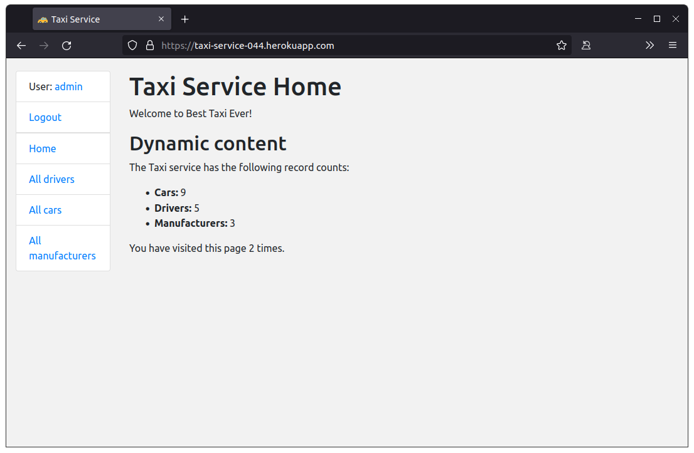

# Taxi Service Project

Django project for managing drivers, cars and manufacturers for Taxi Service

## Check it out

[Taxi Service project on Heroku](https://)

## Installation

Python3 must be already installed

```shell
git clone https://github.com/vldtsw/taxi_servise.git
python3 -m venv venv
source venv/bin/activate on Mac OS or venv/Scripts activate on Windows
pip install -r requirements.txt
python manage.py runserver
```

## Features

* Authentication functionality for Driver/User
* Managing drivers, cars and manufacturers using crud operations from website
* Powerful admin panel for advanced managing

## Demo



Demo full accesses: 
* Username:
* Password: